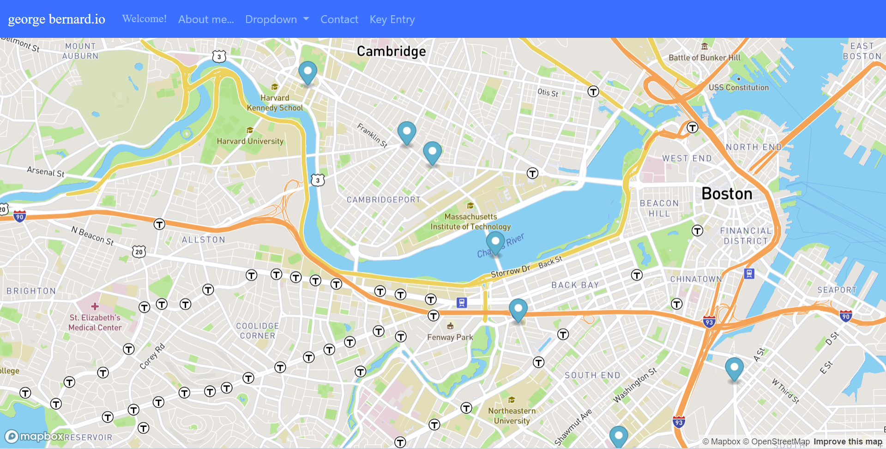

#Bus Tracker Live

##Click here to see[https://georgebernard4.github.io/realtimeBusTracker/]
##Skills Shown: Integrating multiple API's, asynchornous programming, JS, CSS, Bootstrap
##Description
###Queries the API of a transportation authority (MBTA of Boston) to show a map of the bus locations (on route 1 near MIT) using the Mapbox.com API.
##Mapbox.com API Key Entry
###The API key from Mapbox.com can be entered in the file pasteYourMapboxKeyInHere.js or using the off-canvas start panel.
###The format of the API is checked, then shows the map by linking to another page (hashIsKey.html) and passing the key by writing it in the URL hash.
###In the future I would also like to be able to enter the API key in the hash of the bus tracker.  Things have been programed to accomplish this, only the function gethashkey in findkey.js must be modified in order to achive this.
